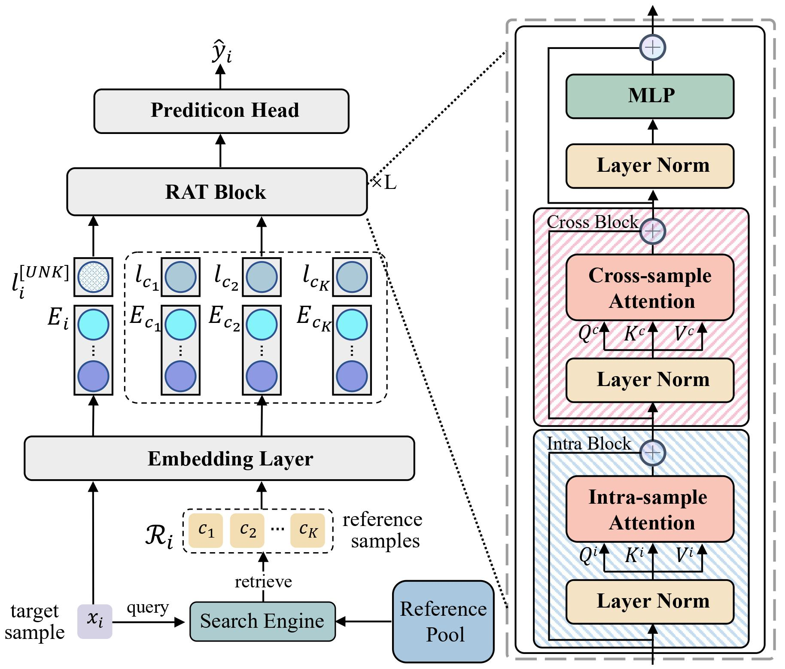

# CTR Hackathon — README (кратко и по делу)

## 1) Задача хакатона
Предсказать вероятность клика по рекламному показу (CTR) для каждой строки теста. Цель — минимизировать **logloss** и/или максимизировать **ROC‑AUC** на скрытой валидации системы.  
**Идея:** строим надёжный онлайн‑подобный пайплайн, который переносится на будущее без утечек по времени.

---

## 2) Что за данные у нас есть
- **Формат Avazu‑подобный:** табличные логи показов/кликов.
- **Ключевые поля:** `click` (таргет в train), `hour` (временная метка вида `%y%m%d%H`), категориальные колонки (`C15..C21`, `banner_pos`, `device_type`, `device_conn_type`, `C1`, а также `site_* / app_* / device_*`, если присутствуют).
- **Файлы:** `train.csv`, `test.csv`, `sample_submission.csv`.
- **Валидация:** последний по времени день — валидация; остальное — обучение. Первый день часто исключаем из train для корректной инициализации счётчиков.
**Идея:** строгое разделение по времени имитирует прод, поэтому метрика честная и стабильная.

---

## 3) Что мы сгенерировали сами (фичи/артефакты)
**Временные признаки**
- День недели, час суток, «час‑в‑неделе», циклические синусы/косинусы.  
**Частотные/статистические**
- OOF‑**CTR‑кодирование** по ключевым категориям (сглаживание, минимальная поддержка).  
- **CUMCOUNT/частоты** встречаемости для категорий и некоторых крестов.  
**Технические артефакты/маски**
- Честные **маски train/valid** по датам, маппинги категорий, типы данных (`int*`, `float32`) для экономии RAM.  
**Для RAT**
- **Ретривел‑индексы:** для каждой строки собраны K прошлых «соседей» по совпадениям ключей (и/или по близости в эмбеддингах). В будущем соседи не заглядывают.
**Идея:** базовые time/CTR/частоты дают табличный фундамент; ретривел подготавливает контекст для RAT.

---

## 4) MLP (и зачем он нужен в пайплайне)
- **Что делает:** преобразует каждое категориальное поле в обучаемый эмбеддинг и учит **нелинейные пересечения** категорий; на выходе — **логит** вероятности клика.
- **Как используется:** предсказания MLP переводятся в **логиты** и подаются в **LightGBM как `init_score`**. Далее LightGBM «дочищает» остаточные зависимости на табличных фичах (time/CTR/cumcount и т. п.).
- **Почему работает:** деревьям сложно ловить редкие пересечения высококардинальных категорий, а MLP учит их естественно; бустинг при этом остаётся сильным на числах и взаимодействиях.
- **Практика:** следим за дисбалансом классов (веса/семплер), аккуратно выровненным порядком строк для `init_score`, и калибровкой (в `init_score` — именно **логиты**, не вероятности).
**Идея:** MLP даёт качественную «базу» по категориям, LGBM калибрует и доводит итог — вместе стабильно сильнее.

---

## 5) RAT (Retrieval‑Augmented Transformer) и его роль

- **Что делает:** добавляет к целевой записи **локальный исторический контекст** — K прошлых «соседей». Модель с чередованием внимания **по соседям внутри поля** и **между полями** извлекает закономерности уровня «на похожих условиях кликали/не кликали».
- **Как используется:** выход RAT (логиты/вероятности, переведённые в логиты) подаётся в **LightGBM как `init_score`**, как и в случае с MLP.
- **Почему работает:** контекст ближайшей истории помогает там, где одиночных признаков мало (холодные/редкие комбинации); RAT усиливает сигнал, LightGBM завершает картину на табличных фичах.
- **Практика:** строго исключаем будущее при ретривеле, ограничиваем K и размер внутренних представлений для памяти/скорости; следим за равномерностью (без перекоса на сверхчастые корзины).
**Идея:** RAT привносит «память о похожих случаях», что ощутимо повышает качество на сложных/редких паттернах.

---

### Короткий итог
Мы строим **гибрид**: (A) **MLP→LGBM** даёт сильную базу на пересечениях категорий, (B) **RAT→LGBM** добавляет исторический контекст; обе ветки подают **init_score** в LightGBM, который доводит результат на инженерных фичах. Такой ансамбль обычно превосходит чистые деревья и чистые нейросети на CTR‑логах.
